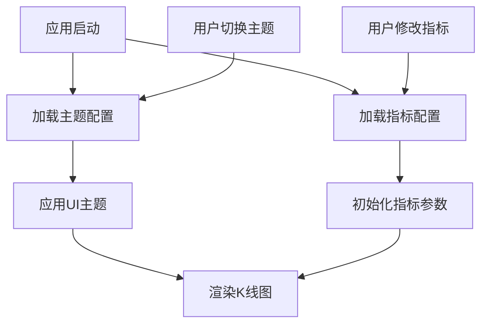

# FlexiKline 配置文件架构指南

## 📁 配置文件结构

FlexiKline 现在采用分离式配置架构，将配置分为两个独立的JSON文件：

```
example/lib/
├── default_flexi_kline_configuration.json      # 主题配置文件
└── flexi_kline_indicators_config.json         # 指标配置文件
```

## 🎨 主题配置文件 (default_flexi_kline_configuration.json)

### 用途
- 控制UI样式、颜色、主题相关设置
- 支持白天/黑夜主题切换
- 包含布局、交互、视觉效果配置

### 主要配置模块

| 模块 | 说明 | 主题相关性 |
|------|------|-----------|
| `grid` | 网格线样式配置 | ✅ 颜色、透明度 |
| `setting` | 基础显示设置 | ✅ 颜色、尺寸 |
| `gesture` | 手势交互配置 | ❌ 行为逻辑 |
| `cross` | 十字线样式配置 | ✅ 颜色、样式 |
| `draw` | 绘制工具样式配置 | ✅ 颜色、样式 |
| `mainIndicator` | 主区域布局配置 | ✅ 尺寸、间距 |
| `sub` | 副区域布局配置 | ✅ 尺寸、间距 |
| `_themeColors` | 主题色彩定义 | ✅ 全部 |
| `_performance` | 性能优化设置 | ❌ 性能参数 |

## 📊 指标配置文件 (flexi_kline_indicators_config.json)

### 用途  
- 独立于主题的指标参数配置
- 技术指标的计算参数和显示设置
- 指标组合和分组管理

### 主要配置模块

| 模块 | 说明 | 示例 |
|------|------|------|
| `mainIndicators` | 主区指标配置 | MA、EMA、BOLL、SAR等 |
| `subIndicators` | 副区指标配置 | MACD、KDJ、RSI等 |
| `indicatorGroups` | 指标分组 | 趋势、动量、成交量 |
| `defaultCombinations` | 预设指标组合 | 基础、进阶、专业组合 |
| `widthSettings` | 宽度配置管理 | 全局、响应式、无障碍宽度 |
| `calculation` | 计算相关配置 | 最少数据点、精度设置 |

## 🔄 配置文件关系



## 🚀 使用优势

### 1. **主题独立性**
- 指标配置不受主题切换影响
- 用户的指标参数设置得到保持
- 支持多套主题配置

### 2. **配置管理**
- 更清晰的配置结构
- 更容易维护和扩展  
- 降低配置文件复杂度

### 3. **开发友好**
- 指标开发者只需关注指标配置文件
- UI设计师只需关注主题配置文件
- 降低配置冲突风险

## 💡 最佳实践

### 主题配置文件
```json
{
  "_comment": "专注于视觉样式配置",
  "grid": {
    "horizontal": {
      "line": {
        "paint": {
          "color": "0xffe9e9e9"  // 主题相关颜色
        }
      }
    }
  }
}
```

### 指标配置文件
```json
{
  "_comment": "专注于业务逻辑配置",
  "mainIndicators": {
    "ma": {
      "config": {
        "periods": [5, 10, 20, 30],  // 业务参数
        "colors": ["0xff2196f3"]     // 指标专用颜色
      }
    }
  }
}
```

## 🔧 迁移指南

### 从旧配置迁移

1. **提取指标配置**
   ```bash
   # 将原配置文件中的指标相关配置
   # 迁移到 flexi_kline_indicators_config.json
   ```

2. **保留主题配置**
   ```bash
   # 在 default_flexi_kline_configuration.json 中
   # 保留颜色、样式、布局等主题相关配置
   ```

3. **更新引用关系**
   ```dart
   // 在代码中分别加载两个配置文件
   final themeConfig = await loadThemeConfig();
   final indicatorConfig = await loadIndicatorConfig();
   ```

## 📝 注意事项

1. **配置同步**
   - 两个配置文件需要保持版本同步
   - 修改时注意配置的兼容性

2. **颜色管理**
   - 主题颜色统一在 `_themeColors` 中定义
   - 指标配置中的颜色可以引用主题颜色

3. **性能考虑**
   - 指标配置文件较大，建议按需加载
   - 主题配置文件应保持轻量化

## 📏 宽度配置详解

### 全局宽度管理
指标配置文件新增了 `widthSettings` 模块，提供全面的宽度控制：

```json
{
  "widthSettings": {
    "global": {
      "lineWidthMultiplier": 1.0,    // 全局线宽倍数
      "pointSizeMultiplier": 1.0,    // 全局点大小倍数
      "barWidthMultiplier": 1.0      // 全局柱宽倍数
    },
    "responsive": {
      "enabled": true,
      "breakpoints": {
        "small": { "screenWidth": 360, "multiplier": 0.8 },
        "medium": { "screenWidth": 768, "multiplier": 1.0 },
        "large": { "screenWidth": 1024, "multiplier": 1.2 }
      }
    },
    "accessibility": {
      "highContrastMode": {
        "lineWidthIncrease": 0.5,
        "pointSizeIncrease": 1.0
      }
    }
  }
}
```

### 指标级宽度配置
每个指标都可以独立配置宽度参数：

- **线性指标**：`lineWidth`、`pointRadius`
- **柱状指标**：`barWidth`、`borderWidth`
- **点状指标**：`pointRadius`、`minRadius`、`maxRadius`
- **复合指标**：组合多种宽度配置

### 配置优势
- **设备适配**：自动根据屏幕尺寸调整
- **无障碍支持**：高对比度模式自动优化
- **用户定制**：支持个性化宽度偏好
- **性能优化**：根据设备性能调整复杂度

详细配置指南请参考：`indicator_width_config_guide.md`

## 🔮 未来扩展

- 支持多套指标配置方案
- 支持用户自定义指标配置
- 支持配置文件的在线同步
- 支持配置的导入导出功能
- 支持动态宽度主题切换
- 支持AI智能宽度推荐
